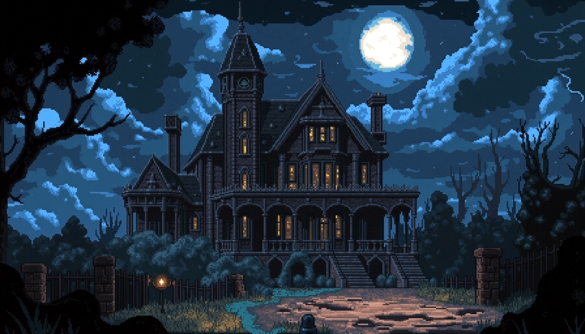
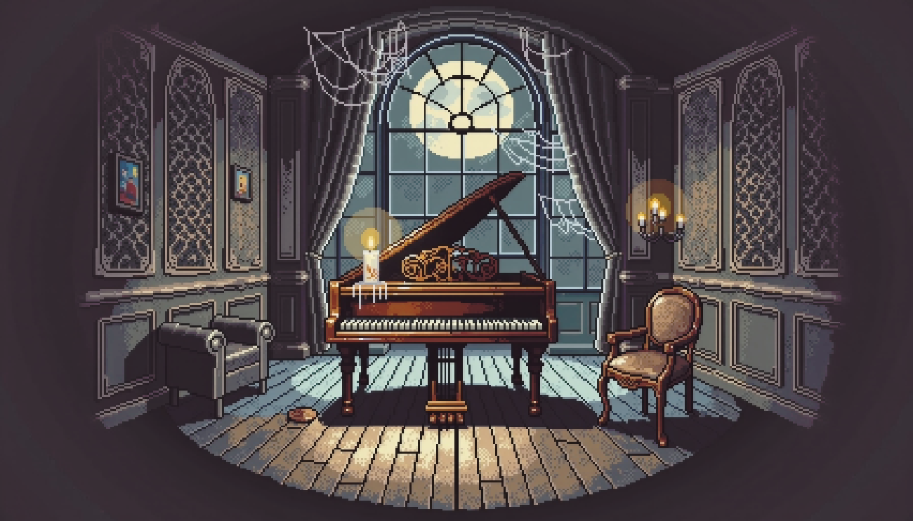

# Haunted House Project — Version 2.0.0 (Archival Branch)

Welcome to the historical v2.0.0 release of the Haunted House Project. This repository branch is preserved in its original state to showcase the evolutionary development, structural milestones, and logic design of the engine prior to the standalone optimizations introduced in later major versions.

A **gothic-industrial text adventure game** built using **JavaFX**, where players navigate a surreal nightmare realm, solve environmental lock puzzles, and manage an item inventory to secure an escape.

## 📸 Screenshots
| First 'Room' of the Game | Room Example 2 |
| :---: | :---: |
|  |  |

## 🏛️ Project Purpose & Context
This game was developed as one of my final projects for my **STECH** class to synthesize and demonstrate core Java programming paradigms, object-oriented design, dynamic event handling, and desktop GUI construction. 

---

## 🎨 Aesthetic & Assets
The visual narrative relies heavily on a grim, atmospheric aesthetic:
* **Background Environments:** The gothic, industrial pixel art rooms were engineered using generative frameworks (**DALL-E 3** and **FLUX.1-dev**).
* **Inventory Icons:** Item sprites utilize traditional 16/32-bit pixel art styles sourced via open-license creators on **itch.io**.

---

## ⚙️ Core Architecture (At a Glance)
* **State Management:** Room layout, exit routing, and item verification are handled cleanly via decoupled collections (`HashMap`, `ArrayList`, and `HashSet`).
* **JavaFX Event Pipeline:** Features a dual-input control layout. Players can trigger `Look Around` or `Search` actions using the top global menu bar or via a context-aware right-click menu.
* **Visual Transitions:** Employs synchronized, asynchronous `FadeTransition` sequences to mask background assets loading into memory during room switches.

---

## 🛠️ Archival Installation & Execution Notes

> [!IMPORTANT]
> **Pathing Constraint Note:** This historical version utilizes direct relative file paths (`file:src/resources/...`) optimized for desktop IDE runtime environments. It is not configured as a standalone JAR.

To run this specific build without asset breaking:
1. **Clone the historical branch:**
```sh
   git clone [https://github.com/your-username/haunted-house-game.git](https://github.com/your-username/haunted-house-game.git)
